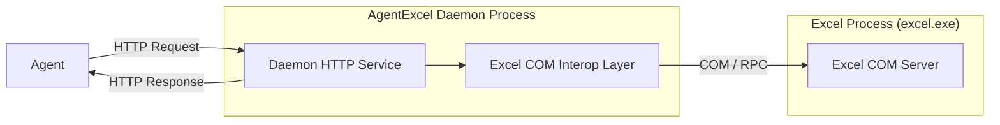

[](https://opensource.org/licenses/MIT)
[](https://github.com/ecator/agent-excel/releases)

[🇨🇳中文](https://www.readme-i18n.com/zh/ecator/agent-excel)
[🇯🇵日本語](https://www.readme-i18n.com/ja/ecator/agent-excel)
[🇰🇷한국어](https://www.readme-i18n.com/ko/ecator/agent-excel)
[🇩🇪Deutsch](https://www.readme-i18n.com/de/ecator/agent-excel) 
[🇪🇸Español](https://www.readme-i18n.com/es/ecator/agent-excel)
[🇫🇷français](https://www.readme-i18n.com/fr/ecator/agent-excel)
[🇵🇹Português](https://www.readme-i18n.com/pt/ecator/agent-excel)
[🇷🇺Русский](https://www.readme-i18n.com/ru/ecator/agent-excel)


# AgentExcel

A local HTTP API service accompanied by a lightweight CLI client designed to control Microsoft Excel via RESTful APIs, specifically tailored for AI Agents.

The architecture is outlined below:



## Installation

Please download [use-agent-excel.zip](https://github.com/ecator/agent-excel/releases/latest) and extract it to your agent's skills folder (e.g., `.agents/skills`).
Once installed, you can ask your agent questions like:
```
What workbooks are currently open?
```

## Core Features

- **High-Frequency Control**: Enables AI agents to read and write Excel sheets currently open and operated by the user at extreme speeds.
- **Client-Daemon Architecture**:
  - **Daemon**: A persistent background service holding the Excel COM object handles long-term, exposing local HTTP endpoints.
  - **Client**: A lightweight CLI trigger to start, stop, or check the status of the daemon.
- **COM Safety**: Focuses on attaching to existing Excel instances and preventing memory leaks or zombie processes.

## Tech Stack

- **Language/Framework**: C# 13 / .NET 10 (Windows platform only)
- **Framework**: ASP.NET Core Minimal APIs
- **Dependency**: Microsoft Office Excel COM Interop

## Quick Start

### CLI Lifecycle Management

**Start the Service** (Runs the daemon silently in the background):
```powershell
AgentExcel.exe start
```

**Check Status**:
```powershell
AgentExcel.exe status
```

**Stop the Service**:
```powershell
AgentExcel.exe stop
```

**Show API Documentation**:
```powershell
AgentExcel.exe api
```
> Please see [SKILL.md](skills/use-agent-excel/SKILL.md) for API usage details.

## Developer Guide

For detailed guidelines, code style standards, and COM memory management rules, please refer to [AGENTS.md](AGENTS.md).

### Development Scripts

The project includes PowerShell scripts in the `scripts/` directory to automate common development tasks:

*   **`build.ps1`**: Stops any running background daemon to prevent file locks, then builds the solution.
*   **`cli.ps1`**: A wrapper for executing `AgentExcel.exe` CLI commands. It automatically rebuilds the project if source files have been updated.
*   **`format.ps1`**: Formats the C# source files using `dotnet format`.
*   **`publish.ps1`**: Publishes the project as a self-contained, single-file executable under `skills/use-agent-excel/bin/`.
*   **`start.ps1`**: Starts the daemon server on port `4869` via the CLI wrapper.
*   **`stop.ps1`**: Gracefully stops the running daemon server.
*   **`test.ps1`**: Ensures Microsoft Excel is running (launches it if necessary) and executes the unit/integration tests with `dotnet test`. You can pass additional arguments (e.g. `--filter`).
*   **`version.ps1 <version>`**: Updates the version number in `AgentExcel.csproj` and the skill manifest `SKILL.md`.

### Releasing a New Version

Follow these steps to release a new version of AgentExcel:

1.  Update the version number across the repository using the versioning script:
```powershell
.\scripts\version.ps1 x.y.z
```
2.  Stage the changes:
```powershell
git add .
```
3.  Commit the changes (e.g., using a conventional commit message):
```powershell
git commit -m "chore: bump version to x.y.z"
```
4.  Create a Git tag for the new version:
```powershell
git tag vx.y.z
```
5.  Push the commit and tag to the remote repository:
```powershell
git push
git push --tags
```
