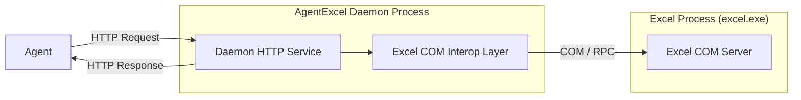

# Use AgentExcel

This skill provides instructions for utilizing the `AgentExcel.exe` CLI tool to automate and manage Microsoft Excel. It spins up a local background HTTP daemon (server) and communicates with it via HTTP requests to read/write active workbooks efficiently.

The architecture is outlined below:



## Prerequisites

Before executing any Excel tasks, you **MUST** run the environment check script below. If the prerequisites are not met, report the details to the user based on the script's output:

```powershell
powershell -ExecutionPolicy Bypass -File "scripts\Check-Prerequisites.ps1"
```

## Executable Path

*   **Rule**: Always interact with Excel via the `AgentExcel.exe` CLI tool. Do **not** manipulate Excel files directly (e.g., using Python libraries like pandas or openpyxl) unless explicitly directed.
*   **Path**: The executable is located in the `bin` directory of this skill. (The `Check-Prerequisites.ps1` script validates this location).
*   **Execution**: Because the tool resides in `bin`, run all commands using its path relative to the workspace, for example: `.\skills\use-agent-excel\bin\AgentExcel.exe <command>`.

## Daemon Lifecycle Management

Before sending any Excel API requests, you must ensure the background daemon service is running.

1.  **Check Status**: Check if the service is already running by executing:
```powershell
AgentExcel.exe status
```
2.  **Start Daemon**: If the status indicates the daemon is not running, start it:
```powershell
AgentExcel.exe start
```

## API Documentation and Help

Once the daemon is active, it runs locally on a dynamic port. You do not need to discover or call the HTTP endpoints directly via custom scripts (like curl or python). You can inspect the list of available API routes by running:

```powershell
AgentExcel.exe api
```

The `api` command supports two-level filtering (group and endpoint name) with wildcard/glob (`*`) matching:

*   **Summary mode**: If no `endpoint` parameter is specified, it shows only the group names and the endpoint paths with their summary descriptions (excluding detailed body schemas):
    *   `AgentExcel.exe api`: Lists all groups and endpoints' summaries.
    *   `AgentExcel.exe api range`: Lists summaries only for endpoints in the `range` group.
    *   `AgentExcel.exe api *`: Lists summaries for all endpoints across all groups.
*   **Detailed mode**: If an `endpoint` parameter is specified, it prints the detailed documentation including the request body JSON schema:
    *   `AgentExcel.exe api range /range/write`: Shows the detailed documentation for the `/range/write` endpoint (exact/suffix match).
    *   `AgentExcel.exe api range write`: Shows the detailed documentation by matching the endpoint name without a leading slash (matches paths ending with `/write`, such as `/range/write`). **Note**: The matched endpoint path must belong to the specified group (in this case, `range`).
    *   `AgentExcel.exe api range *write*`: Shows the detailed documentation for endpoints in the `range` group whose paths contain `write`.
    *   `AgentExcel.exe api range *`: Shows details for all endpoints in the `range` group.
    *   `AgentExcel.exe api * *`: Shows details for all endpoints across all groups.

Note: Filtering is entirely case-insensitive.

## Invoking API Operations

Instead of using raw HTTP tools like `curl`, use the built-in `get` and `post` subcommands of `AgentExcel.exe` to query or modify Excel.

### 1. Simple Requests (Without Payload)
```powershell
AgentExcel.exe post /workbooks/list
```

### 2. Request with Payload (JSON Body)
You can pass the JSON body as a direct argument or pipe it via standard input (stdin):

*   **Via argument**:
```powershell
AgentExcel.exe post /workbooks/open '{"path":"D:/path/to/your/workbook.xlsx"}'
```
*   **Via standard input (stdin)** using `--stdin`:
```powershell
'{"path":"D:/path/to/your/workbook.xlsx"}' | AgentExcel.exe post /workbooks/open --stdin
```

## Stopping the Service

Under normal circumstances, you do not need to terminate the daemon since leaving it running makes subsequent commands faster. However, if the user explicitly requests to release COM objects or you need to restart the daemon (e.g., due to configuration issues), stop it using:

```powershell
AgentExcel.exe stop
```

## Important Guidelines & Troubleshooting

*   **Startup Delay**: If the daemon has just started, but calling the `api` subcommand fails or reports the service is offline, wait 2–3 seconds for the HTTP server to fully bind, then try again.
*   **Transient COM Connection Errors**: If you encounter errors like `Excel process started but failed to connect via COM.`, retry the command.
*   **Chaining Operations**: To maximize efficiency, chain dependent tasks together in a single turn instead of executing them step-by-step. For instance, open a workbook and list its sheets sequentially:
```powershell
# 1. Open the workbook
'{"path":"D:/path/to/your/workbook.xlsx"}' | AgentExcel.exe post /workbooks/open --stdin
# 2. Immediately query its sheets using the workbook filename
'{"workbook":"workbook.xlsx"}' | AgentExcel.exe post /sheets/list --stdin
```
*   **Shared Excel Instance**: `AgentExcel` attaches to the Excel instance the user is actively working on. Any edits or selections you make will reflect in real-time on the user's screen. If the user asks you to modify "the file I am working on", query the open workbooks to find its name and operate on it directly without reopening it.
*   **Cell Edit Mode Block**: If you receive an `RPC_E_CALL_REJECTED` error, it means Excel has blocked COM communication because the user is currently editing a cell. Prompt the user to exit edit mode (e.g., by pressing `Enter` or `Esc`) and try again.
*   **PowerShell Character Encoding**: When running commands via PowerShell, run these commands first to prevent encoding/character corruption issues (especially with Chinese characters or file paths):
```powershell
[Console]::InputEncoding = [System.Text.Encoding]::UTF8
[Console]::OutputEncoding = [System.Text.Encoding]::UTF8
```